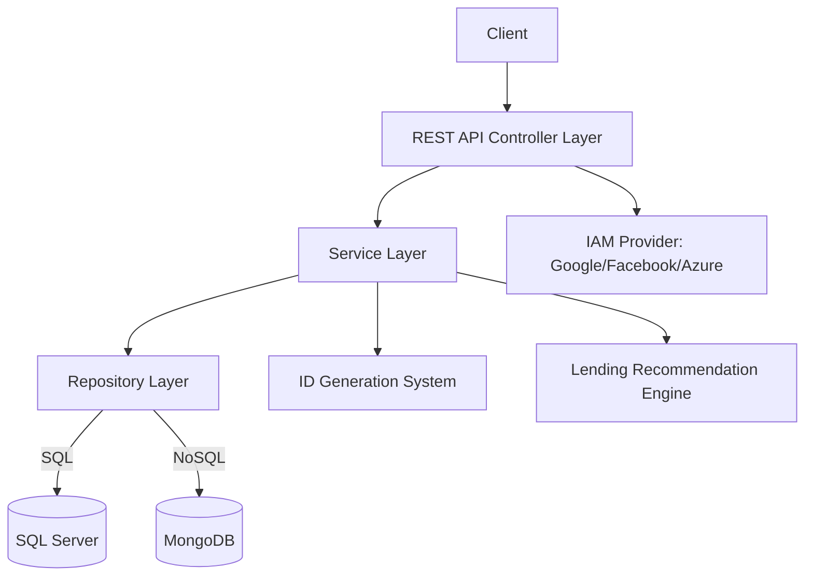

# 📚 Library Management System  

## 📖 Overview  
The **Library Management System** is a REST-oriented backend service designed to manage books, readers, authors, and lending operations.  
This project was developed as part of my Master’s in Software Engineering at ISEP, focusing on **software architecture, configurability, reliability, and extensibility**.  

The system supports multiple **data models** and **databases** (SQL Server, MongoDB, Redis) as well as different **IAM providers** (Google, Facebook, Azure).  
It also includes a **customizable lending recommendation engine** and **runtime configurability** for key features.  

---

## 🚀 Features  
- 📚 CRUD operations for **Books**, **Authors**, and **Readers**  
- 🔑 Support for multiple IAM providers (**Google, Facebook, Azure**)  
- 🗄️ Configurable persistence with multiple databases:  
  - SQL Server  
  - MongoDB  
  - Redis  
- 🛠️ Extensible **ID generation system** (Lending & Author IDs)  
- 🤖 **Lending recommendation engine** customizable at runtime  
- ✅ Automated testing: unit (opaque-box), integration, acceptance, and mutation testing  
- 🔄 CI/CD pipeline with Jenkins (build, test, deploy automation)  
- 📊 Static code analysis integrated with **SonarQube** and **ESLint**  

---

## 🏗️ Architecture  

## 🧪 Testing

- The project integrates multiple testing strategies to ensure reliability and correctness:
  - Unit Tests → opaque-box and transparent-box testing for individual components.
  - Integration Tests → validation of service and database interactions.
	- Acceptance Tests → end-to-end scenarios to validate business requirements.
	- Mutation Testing → using Pitest to measure the quality of test coverage.

- These approaches help validate functionality at different levels, ensuring a robust and maintainable system.

## ⚙️ CI/CD Pipeline

- The CI/CD pipeline was implemented with Jenkins and automates the following processes:
  	- Build → compile and package the backend service.
	  - Static Analysis → integrated with SonarQube and ESLint to identify code smells and vulnerabilities.
	  - Automated Testing → unit, integration, and mutation testing during each build.
	  - Artifact Creation → packaged builds ready for deployment.
	  - Deployment → to both local and remote servers.
	  - Performance Monitoring → automated reporting of coverage, build time, and efficiency.

This ensures continuous integration and continuous delivery, improving development speed and reliability.

## Elements of the group :

 * Fábio Barbosa dos Santos 1170605
 * David dos Santos Ferreira 1240444
